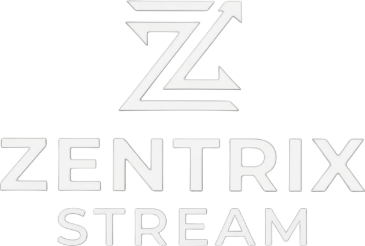

# ZentrixStream 🎬

<p align="center">
  
</p>

<p align="center">
  <strong>The Ultimate Dual-Portal Streaming Experience</strong>
</p>

<p align="center">
  <a href="#features">Features</a> •
  <a href="#installation">Installation</a> •
  <a href="#configuration">Configuration</a> •
  <a href="#api-reference">APIs</a> •
  <a href="#educational-purpose">⚠️ Educational Purpose</a>
</p>

---

## ⚠️ EDUCATIONAL PURPOSE ONLY

> **IMPORTANT LEGAL NOTICE:** This project is created **strictly for educational and research purposes** to demonstrate:
> - Modern web development with PHP and JavaScript
> - API integration with AniList GraphQL and TMDB REST APIs
> - Database design for user management and watch history
> - Responsive UI/UX design with Tailwind CSS
>
> **This project does NOT host any copyrighted content.** All video content is streamed through third-party embedding services. The developers do not endorse or encourage piracy. Users are responsible for complying with their local copyright laws.

---

## 🌟 Features

### Dual Portal Architecture
| Anime Portal | Movie Portal |
|--------------|--------------|
|  |  |
| **AniList Integration** | **TMDB Integration** |
| Neon Cyan Theme (`#00f3ff`) | Neon Red Theme (`#ff003c`) |
| Search, Trending, Schedule | Search, Trending, Popular |
| Episode tracking | Season/Episode navigation |

### Core Features
- 🎨 **Cyberpunk UI Design** - Dark theme with neon accents and animated ambient blobs
- 📱 **Mobile-Optimized** - Fully responsive design for all devices
- 🔍 **Advanced Search** - Real-time search with AniList & TMDB APIs
- 📊 **Continue Watching** - Database-backed watch history with progress tracking
- 🔐 **User Authentication** - Secure signup/login with password hashing
- 🎯 **Spotlight Carousel** - Auto-rotating featured content showcase
- 📈 **Page Analytics** - View counting and like/dislike system

### Technical Stack
```
PHP 8.x        ━━━━━━━━━━  Backend Logic
MySQL/MariaDB  ━━━━━━━━━━  Database
Tailwind CSS   ━━━━━━━━━━  Styling
JavaScript     ━━━━━━━━━━  Interactivity
AniList API    ━━━━━━━━━━  Anime Metadata
TMDB API       ━━━━━━━━━━  Movie/TV Metadata
```

---

## 🚀 Installation

### Prerequisites
- PHP 8.0 or higher
- MySQL 5.7+ or MariaDB 10.3+
- Web server (Apache/Nginx)
- SSL certificate (recommended for production)

### Step 1: Clone Repository
```bash
git clone https://github.com/Zentrix-Dev/ZentrixStream.git
cd ZentrixStream
```

### Step 2: Database Setup
Create a MySQL database and import the required tables:

```sql
-- Users table
CREATE TABLE users (
    id INT AUTO_INCREMENT PRIMARY KEY,
    username VARCHAR(50) UNIQUE NOT NULL,
    email VARCHAR(100) UNIQUE NOT NULL,
    password VARCHAR(255) NOT NULL,
    created_at TIMESTAMP DEFAULT CURRENT_TIMESTAMP
);

-- Watch history table
CREATE TABLE watch_history (
    id INT AUTO_INCREMENT PRIMARY KEY,
    user_id INT NOT NULL,
    anime_id VARCHAR(50) NOT NULL,
    anime_title VARCHAR(255) NOT NULL,
    episode INT DEFAULT 1,
    watched_at TIMESTAMP DEFAULT CURRENT_TIMESTAMP ON UPDATE CURRENT_TIMESTAMP,
    UNIQUE KEY unique_watch (user_id, anime_id),
    FOREIGN KEY (user_id) REFERENCES users(id) ON DELETE CASCADE
);

-- Page analytics table
CREATE TABLE pageview (
    id INT AUTO_INCREMENT PRIMARY KEY,
    pageID VARCHAR(100) UNIQUE NOT NULL,
    totalview INT DEFAULT 0,
    like_count INT DEFAULT 0,
    dislike_count INT DEFAULT 0,
    animeID VARCHAR(50)
);
```

### Step 3: Configuration

#### Anime Portal (`anime/_config.php` & `anime/db.php`)
```php
// Database credentials
$dbHost = 'localhost';
$dbUser = 'your_username';
$dbPass = 'your_password';
$dbName = 'zentrix_db';

// Site settings
$websiteTitle = "Zentrix Stream";
$websiteUrl = "https://yourdomain.com";
```

#### Movie Portal (`movie/_config.php` & `movie/.env`)
```php
// Database (same as above)
// In movie/.env:
TMDB_API_KEY=your_tmdb_api_key_here
```

### Step 4: API Keys

1. **AniList API** - Free, no key required (GraphQL endpoint)
2. **TMDB API** - Get free key at [themoviedb.org/settings/api](https://www.themoviedb.org/settings/api)

---

## 📁 File Structure

```
ZentrixStream/
├── index.php              # Landing page with dual portal
├── LICENSE                # GPL-3.0 License
├── ZentrixDev.png         # Logo asset
│
├── anime/                 # 🎌 ANIME PORTAL
│   ├── index.php          # Main anime browsing
│   ├── _config.php        # Portal configuration
│   ├── db.php            # Database connection
│   ├── pages/            # Portal pages
│   │   ├── watch.php     # Video player
│   │   ├── details.php   # Anime details
│   │   ├── signup.php    # Registration
│   │   ├── login.php     # Authentication
│   │   ├── profile.php   # User profile
│   │   └── ...
│   └── components/       # Reusable sections
│       ├── trending.php
│       ├── schedule.php
│       └── ...
│
└── movie/                 # 🎬 MOVIE PORTAL
    ├── index.php         # Main movie browsing
    ├── _config.php       # Portal configuration
    ├── .env              # API keys (gitignored)
    └── pages/            # Portal pages
        ├── watch.php
        ├── trending.php
        └── ...
```

---

## 🔧 Configuration

### Security Settings
Add to your `php.ini` or `.htaccess`:
```ini
; Hide PHP version
expose_php = Off

; Secure sessions
session.cookie_httponly = 1
session.cookie_secure = 1
session.use_strict_mode = 1
```

### Recommended .htaccess
```apache
# Protect sensitive files
<FilesMatch "^\.">
    Order allow,deny
    Deny from all
</FilesMatch>

<FilesMatch "\.(env|ini|log)$">
    Order allow,deny
    Deny from all
</FilesMatch>

# Enable compression
<IfModule mod_deflate.c>
    AddOutputFilterByType DEFLATE text/html text/css application/javascript
</IfModule>
```

---

## 📚 API Reference

### AniList GraphQL (Anime Portal)
Endpoint: `https://graphql.anilist.co`

Example query for trending anime:
```graphql
query {
  Page(perPage: 15) {
    media(sort: TRENDING_DESC, type: ANIME, isAdult: false) {
      id
      title { english romaji }
      coverImage { extraLarge }
      bannerImage
      description
      episodes
    }
  }
}
```

### TMDB REST API (Movie Portal)
Base URL: `https://api.themoviedb.org/3`

Example endpoints:
- Trending: `/trending/all/day?api_key={KEY}`
- Movie details: `/movie/{id}?api_key={KEY}`
- TV details: `/tv/{id}?api_key={KEY}`

---

## 🛡️ Security Considerations

This codebase implements several security measures:

- ✅ **Prepared Statements** - All database queries use PDO/MySQLi prepared statements
- ✅ **Password Hashing** - bcrypt via `password_hash()`
- ✅ **XSS Protection** - Output escaping with `htmlspecialchars()`
- ✅ **CSRF Tokens** - Form protection implemented
- ✅ **Input Validation** - Server-side validation on all inputs

**Always keep your dependencies updated and follow security best practices.**

---

## 🤝 Contributing

We welcome contributions! Please see [CONTRIBUTING.md](CONTRIBUTING.md) for guidelines.

1. Fork the repository
2. Create a feature branch (`git checkout -b feature/amazing-feature`)
3. Commit changes (`git commit -m 'Add amazing feature'`)
4. Push to branch (`git push origin feature/amazing-feature`)
5. Open a Pull Request

---

## 📜 License

This project is licensed under the **GNU General Public License v3.0** - see [LICENSE](LICENSE) for details.

```
Copyright (C) 2026 Zentrix-Dev

This program is free software: you can redistribute it and/or modify
it under the terms of the GNU General Public License as published by
the Free Software Foundation, either version 3 of the License, or
(at your option) any later version.
```

---

## 🙏 Acknowledgments

- [AniList](https://anilist.co) for comprehensive anime metadata
- [The Movie Database (TMDB)](https://www.themoviedb.org) for movie/TV data
- [Tailwind CSS](https://tailwindcss.com) for the utility-first CSS framework
- [Inter Font](https://rsms.me/inter/) for the beautiful typeface

---

<p align="center">
  <strong>⭐ Star this repository if you find it helpful!</strong>
</p>

<p align="center">
  Made with 💜 by Zentrix-Dev
</p>
